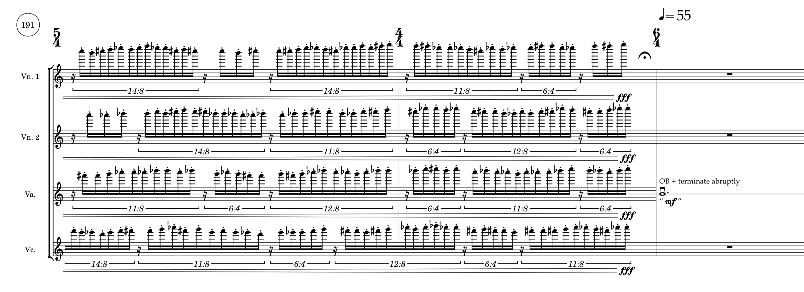

Akasha
======

Akasha (2015) for string quartet.

Akasha (आकाश) is a music of invisibility, electricity and the open expanse of the sky. The
title is the Sanskrit word for the æther, a concept once understood as an unseen force
present in all things in motion in the world. 

World premiere given by the [JACK Quartet](http:/jackquartet.com) on 6 February 2016 in
Paine Hall on the campus of Harvard University. [Complete
recording](https://soundcloud.com/trevorbaca/akasha) available on Soundcloud.

